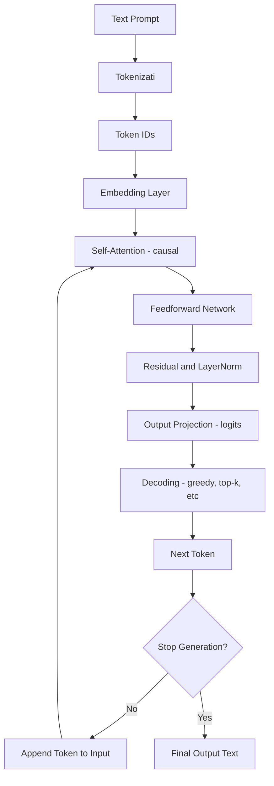

To measure the success of a product, consider including these metrics on your checklist: 

- Track if you implemented the product’s priority requirements
    
- Track and assess the product’s number of technical issues or defects
    
- Measure the percentage of features you delivered or released at the end of the project
## **What is important to the customers or stakeholders**

- Evaluating user engagement with the product 
    
- Measuring stakeholder and customer satisfaction via surveys
    
- Tracking user adoption of the product by using sales data

Success Criteria Template 

  

Defining success criteria tells you whether or not the project was successful. As a best practice, use a template like the one below to help you record, document and align stakeholders on key project components.

  

|                                  |                                                 |         |
| -------------------------------- | ----------------------------------------------- | ------- |
| **Product requirements**         | - -- - -- - --                            |         |
| **Priority requirements**        | - -- - -- - --                            |         |
| **Goal metrics**                 |                                                 |         |
| User engagement                  | Goal:                                           | Actual: |
| User adoption                    | Goal:                                           | Actual: |
| Technical issues/defects         | Goal:                                           | Actual: |
| % of features delivered/released | Goal:                                           | Actual: |
| _[Add metric]_                   | Goal:                                           | Actual: |
| _[Add metric]_                   | Goal:                                           | Actual: |
| _[Add metric]_                   | Goal:                                           | Actual: |
| **Sign-offs**                    | - Name / Date - Name / Date - Name / Date |         |

- ![[Same Project, Different Perspectives, PMI.pdf]]