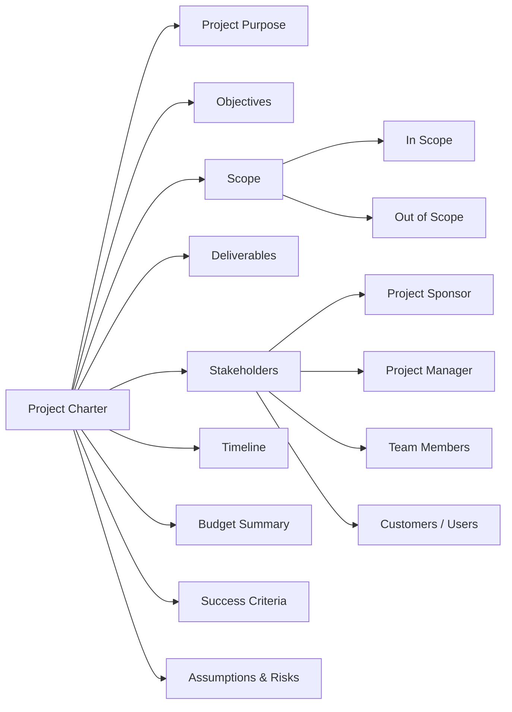

A **project charter** is a high-level document that **formally authorizes** a project to begin and outlines its **key objectives, scope, stakeholders, and authority**.

  

It acts as a **contract between the project sponsor and the project team**.

---

## **📘 General Idea of a Project Charter**

  

### **✅ What It Does:**

- **Authorizes** the project and gives the project manager authority
    
- Defines **why** the project exists and **what it’s meant to accomplish**
    
- Aligns stakeholders on **goals, scope, and success criteria**
    
- Helps avoid confusion or scope creep later on
    

---

## **📋 Common Elements of a Project Charter**

|**Section**|**Description**|
|---|---|
|**Project Purpose**|Why the project is being done (business need or opportunity)|
|**Objectives**|Clear, measurable goals (e.g., launch website, reduce cost)|
|**Scope**|High-level boundaries (what’s included and excluded)|
|**Deliverables**|Key outputs (e.g., report, product feature, system upgrade)|
|**Stakeholders**|Who’s involved (sponsor, team, customer)|
|**Roles and Responsibilities**|Who does what (esp. project manager)|
|**Timeline**|Target start and end dates|
|**Budget Summary**|Initial cost estimate or funding source|
|**Risks and Assumptions**|Known risks and what is assumed at the outset|
|**Success Criteria**|How success will be measured (e.g., on time, on budget, outcomes)|

---

## **🛠️ Who Uses It?**

- **Project Sponsor**: Signs off and provides funding
    
- **Project Manager**: Uses it to guide planning and execution
    
- **Team Members**: Refer to it to understand the project’s goals and their roles
    
- **Stakeholders**: Use it for clarity and alignment
    

---

## **🧠 Simple Analogy**

  

> Think of the **project charter** like the **blueprint for a road trip**:

- > Where you’re going (objectives)
    
- > Who’s driving (roles)
    
- > How much it will cost (budget)
    
- > When you’re leaving and arriving (timeline)
    
- > And why you’re going at all (business case)
    

---

Project charters will vary but usually include some combination of the following key information:

- introduction/project summary
    
- goals/objectives 
    
- business case/benefits and costs
    
- project team
    
- scope
    
- success criteria
    
- major requirements or key deliverables
    
- budget
    
- schedule/timeline or milestones
    
- constraints and assumptions
    
- risks
    
- OKRs
    
- approvals

