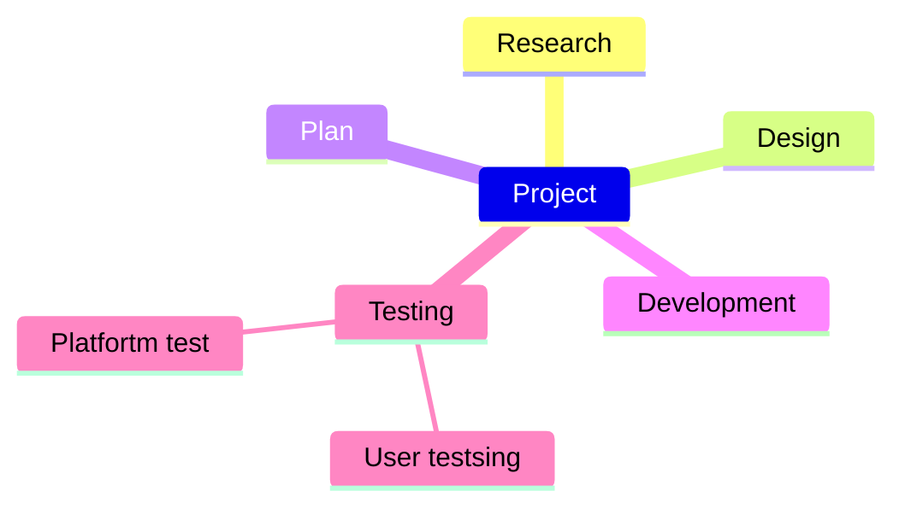
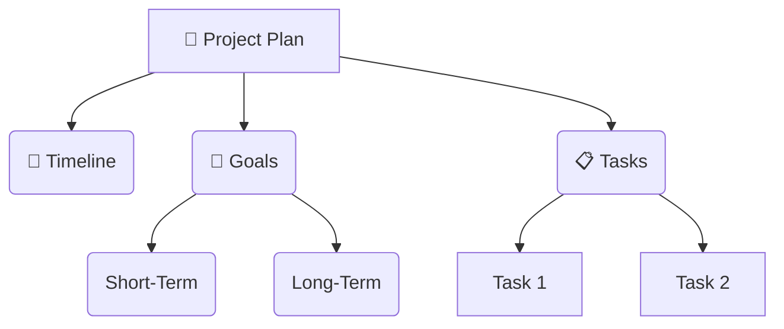
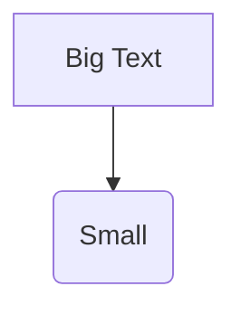

---
tags:
  - pm
share: "true"
---

```mermaid
mindmap
    Project
        Research
        Design
        Plan
        Development
        Testing 
	        User testsing
	        Platfortm test
```  

```mermaid
graph TD
    A[📘 Project Plan]
    A --> B(📅 Timeline)
    A --> C(🎯 Goals)
    A --> D(📋 Tasks)
    D --> D1[Task 1]
    D --> D2[Task 2]
    C --> C1(Short-Term)
    C --> C2(Long-Term)
```

```mermaid
graph TD
  A[<span style='font-size:16px'>Big Text</span>] --> B(Small) 
```
